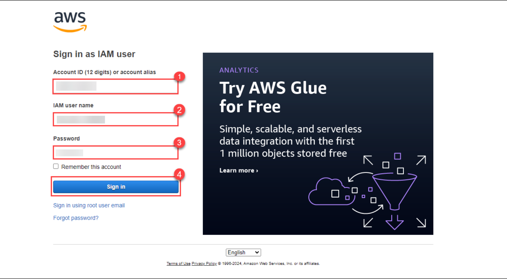
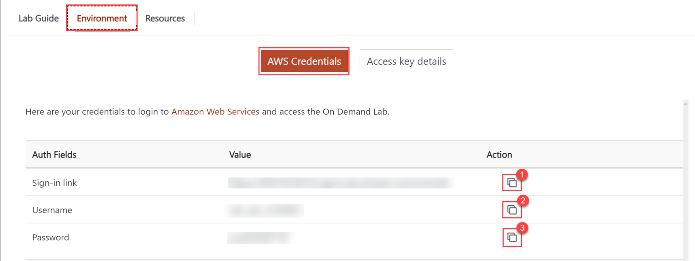
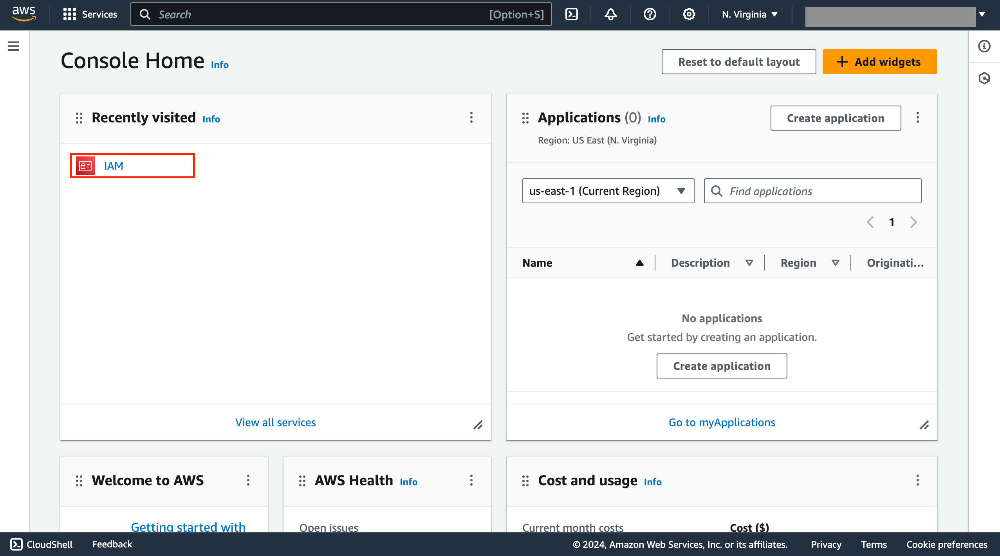

 
## Getting Started With AWS IAM Service
Follow the steps below to get started with the lab.

# Exercise.1 
**Login to AWS console**

## Task.1

Open Google Chrome and sign in to the AWS Management Console by copying the **Sign-in link, Username, and Password** provided below.
- **Sign-in Link**:
- **IAM Username**:
- **Password**:

## Task.2

Alternatively, you can also find these values on the **CloudLabs** Environment tab.

## Task.3

After signing in to the AWS Management Console, choose the IAM service, through which we have to create Roles 

<question source="https://raw.githubusercontent.com/GaneshHC/solid-disco/codespace-solid-disco-x6p4rpvjwj63vpv7/lab-validation/valid-quest1.md" />

 

 
