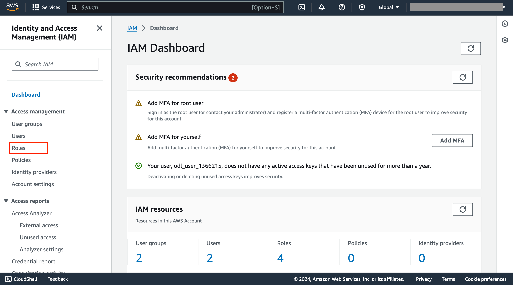
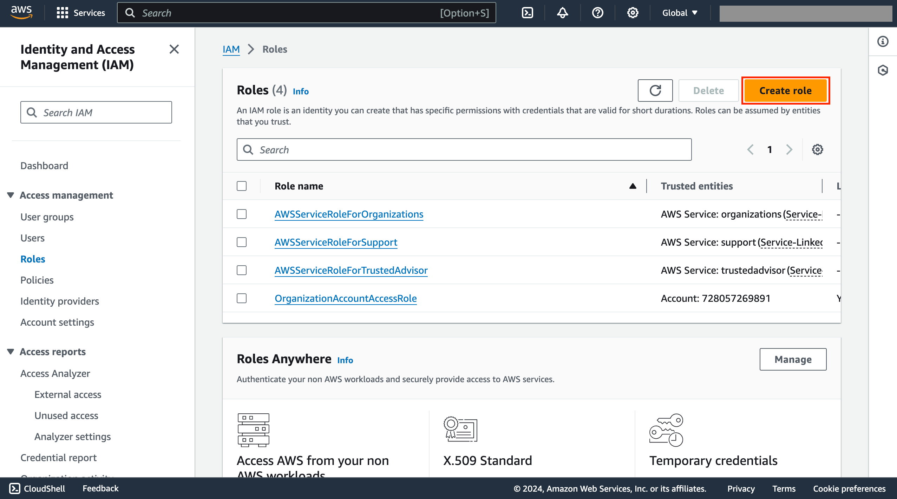
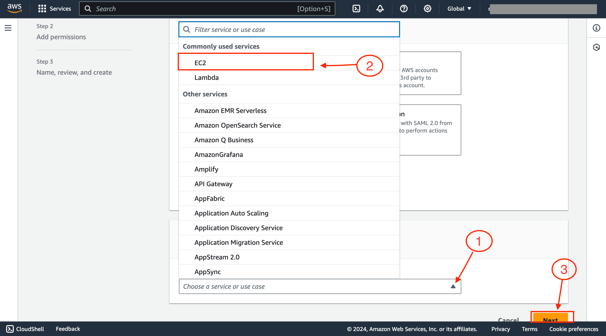

 
 

# Exercise.2
**Starting with Roles from dashboard**

## Task.1

selct **Roles** from IAM dashboard

## Task.2

Then you will be listed with pre-created Roles list, there continue with **Create role** option

## Task.3

1. Now click on arrow mark to list service or use case
2. Select EC2 for which we are creating role
3. After selcting service click on **Next** option

 
