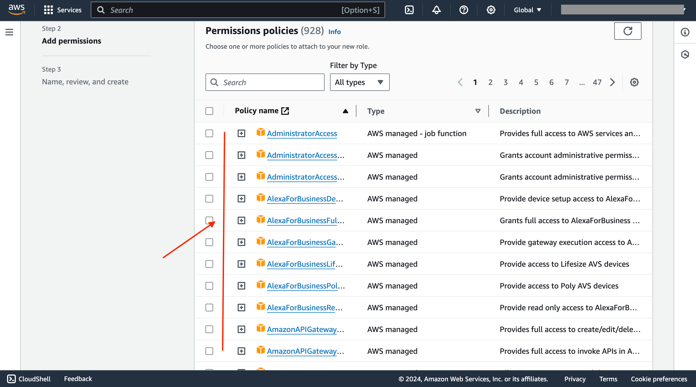
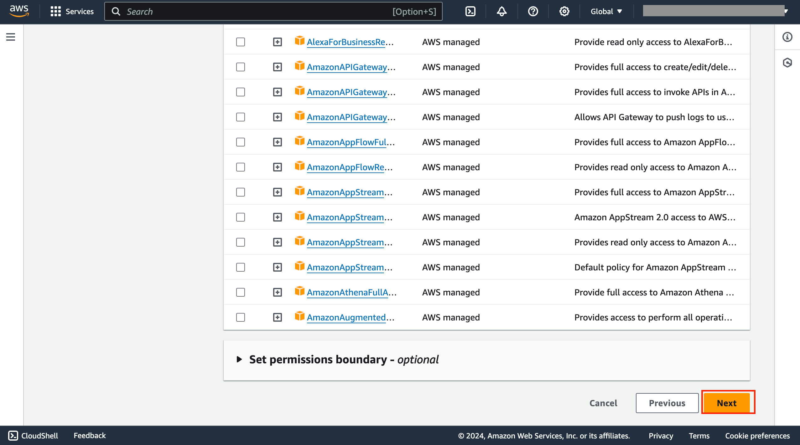

 
 

# Exercise.3
**Attaching policies to the role**

## Task.1

You will be listed with policies, select policy that need to be attached

## Task.2

After selecting policy click on **Next** option

 
 
 
<question source="https://raw.githubusercontent.com/Sahil-8577/role_lab_guide_ques/main/lab_guide/valid-quest1.md" />

<question source="https://raw.githubusercontent.com/Sahil-8577/role_lab_guide_ques/main/lab_guide/valid-quest2.md" />
 
